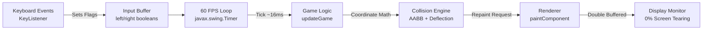

100%
# 🎮 Java 2D Game Development: The Complete Master Guide

A complete, production-grade guide to building a 2D Arcade Game (**Retro Brick Breaker**) in standard Java using pure JDK libraries (`javax.swing` and `java.awt`).

---

## 📑 Architecture Overview

Every game is built upon the **Input-Update-Render Cyclic Pipeline**:



---

## 📦 File by File Breakdown & Guide

### 1. `Main.java` — The Window & Entry Point
* **Role:** Initializes the OS window container (`JFrame`), mounts the game canvas (`GamePanel`), and starts the engine.
* **Key Mechanisms:**
  * `SwingUtilities.invokeLater(...)`: Forces window creation to run on the **Event Dispatch Thread (EDT)**, avoiding concurrency race hazards on window launch.
  * `frame.setResizable(false)`: Locks pixel resolution so collision math doesn't stretch or break.
  * `frame.pack()`: Inspects the `setPreferredSize` of `GamePanel` (800x600) and sizes the window borders around it, preventing the OS title bar from stealing canvas space.

---

### 2. `GamePanel.java` — The Heartbeat Engine & State Controller
* **Role:** Subclasses `JPanel` and implements `ActionListener` (for the 60 FPS loop) and `KeyListener` (for keyboard polling).
* **Key Mechanisms:**
  * **The 60 FPS Game Loop:** `new Timer(16, this)` fires an `ActionEvent` every 16 milliseconds ($1000 / 60  pprox 16.6	ext{ ms}$).
  * **The Input State Buffer:** Never moves players inside `keyPressed()`! Instead, flips `leftPressed = true` on key down, and `false` on key up. The 60 FPS loop reads the flags, giving **stutter-free, fluid movement**.
  * **State Machine:** An `enum State { MENU, PLAYING, PAUSED, LEVEL_CLEARED, GAME_OVER }` ensures clean screen routing without tangled boolean checks.
  * **Double Buffering:** In Swing, `JPanel` has double-buffering enabled by default (`super.paintComponent(g)` wipes the off-screen buffer).

---

### 3. `Paddle.java` — Player Actor & Screen Bounds Clamping
* **Role:** Represents the player-controlled slider at the bottom of the screen.
* **Key Mechanisms:**
  * Velocity-based movement: `x -= speed` and `x += speed`.
  * **Boundary Clamping:** Prevents the paddle from flying off the left (`x < 15`) or right edges (`x + width > screenWidth - 15`).
  * `getBounds()`: Returns a `java.awt.Rectangle` used for rapid AABB collision checks.

---

### 4. `Ball.java` — 2D Physics & Dynamic Deflection
* **Role:** Moving orb that rebounds off walls, bounces off the paddle, and shatters bricks.
* **Key Mechanisms:**
  * **Vector Motion:** In each frame, `x += dx` and `y += dy`.
  * **Dynamic Paddle Deflection:** Instead of a boring 90-degree bounce, the ball calculates where it hit the paddle:
    $$	ext{offset} = rac{	ext{ballCenter} - 	ext{paddleCenter}}{	ext{paddleWidth} / 2}$$
    Hitting the center launches the ball straight up; hitting the outer edges launches it diagonally!

---

### 5. `Brick.java` — Destructible Grid Targets & Scoring
* **Role:** Grid of colorful destructible blocks with points and bevel visual styling.
* **Key Mechanisms:**
  * Arranged dynamically into 5 rows $	imes$ 10 columns.
  * Color-coded scoring: Pink (50 pts), Orange (40 pts), Yellow (30 pts), Lime (20 pts), Cyan (10 pts).
  * Rendered with upper highlight bevels and lower shadow bevels for a glossy 3D look.

---

### 6. `Particle.java` — Explosive Visual Juice
* **Role:** Spawns 16 tiny glowing spark fragments when a brick shatters.
* **Key Mechanisms:**
  * Trigonometric angle dispersal: $\cos(	heta) 	imes 	ext{speed}$, $\sin(	heta) 	imes 	ext{speed}$.
  * Alpha transparency decay: `alpha -= 10` per frame until fully faded.

---

### 7. `Sound.java` — In-Memory Sound Synthesizer (Zero External Files!)
* **Role:** Generates authentic retro arcade sound effects purely through mathematics.
* **Key Mechanisms:**
  * Uses `javax.sound.sampled.AudioSystem` to synthesize pure sine waves into an 8-bit PCM byte buffer.
  * No `.wav` or `.mp3` files needed on disk! Everything compiles and plays natively.

---

## 🚀 How to Compile and Run

Open PowerShell in the project directory:

```powershell
cd "C:\Users\cheehow\Documents\JavaSmallGame"

# 1. Compile all Java source files
javac game/*.java -d bin

# 2. Run the game
java -cp bin game.Main
```

### In-Game Controls
* **Left / Right:** `A / D` or `Left / Right Arrow`
* **Launch / Start:** `Spacebar`
* **Pause / Resume:** `P`
* **Restart:** `R` (on Game Over)
